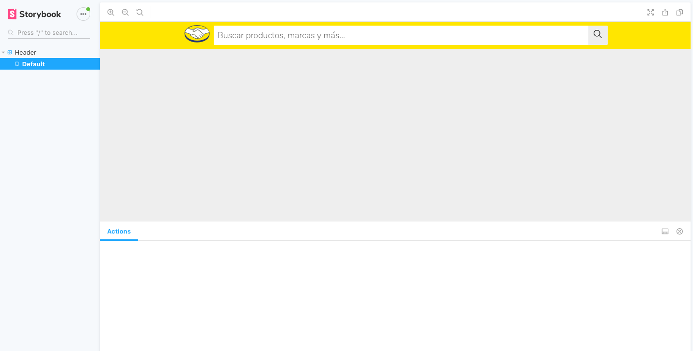

# ML Front-End Test

> ML Front-End Test Application

![Status][status-image]
![License][license-image]
![React][react-image]
![Release][release-image]

## ❗️Requirements

- React >= 16.13.1
- npm >= 6.13.4

## ⬇️ Version

2.0.0

## 🛠 Installation

Download zip file and extract it [latest release](https://github.com/reysmerwvr/ml-frontend-test/releases/latest). Or clone the repository and cd into it.

ML Front-End Test uses a number of open source projects to work properly:

- [React] - A JavaScript library for building user interfaces
- [Storybook] - Storybook is an open source tool for developing UI components in isolation for React, Vue, and Angular.

Install the dependencies and start the server.

```sh
cd ml-frontend-test
npm install
```

## 🚀 Running with NPM

Run the following command to start the HTTP Server.

```sh
cd ml-frontend-test
cp .env.example .env # If you don't have .env file you can use the example one. Just rename .env.example to .env. Enter your configuration here.
npm start # Run React App
npm test # Run tests
npm run storybook # Run Storybook Server
```

## 🐳 Running it with Docker

```sh
cd ml-frontend-test
cp .env.example .env # If you don't have .env file you can use the example one. Just rename .env.example to .env. Enter your configuration here.
docker-compose build
docker-compose -f docker-compose.yml up -d
docker-compose ps
docker-compose down -v # Bring down the development containers (and the associated volumes with the -v flag)
```

## 👁 Preview

[Demo](https://reysmerwvr.github.io/ml-frontend-test/)



### 📝 Todos

- [ ] Add code comments
- [ ] Add missing stories (Storybook)
- [ ] Add integration tests
- [ ] Improve breadcrumb implementation
- [ ] Improve mobile performance
- [ ] Add Loader Component
- [ ] Add pagination and filters
- [ ] Add Dockerfile for production

[//]: # (These are reference links used in the body of this note and get stripped out when the markdown processor does
its job. There is no need to format nicely because it shouldn't be seen. Thanks SO - http://stackoverflow.com/questions/4823468/store-comments-in-markdown-syntax)

   [React]: <https://reactjs.org//>
   [Storybook]: <https://storybook.js.org/>
   [status-image]: <https://img.shields.io/badge/status-development-green>
   [license-image]: <https://img.shields.io/badge/License-MIT-blue.svg>
   [react-image]: <https://img.shields.io/badge/react-16.13.1-blue>
   [release-image]: <https://img.shields.io/badge/release-1.0.0-orange>
